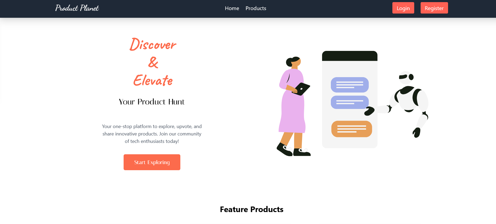

# Project: Product Planet 

**Product Planet OverView**  is a innovative platform. In this platform, users can discover, share, and interact with cutting-edge tech products. From web apps to AI tools, software, games, and mobile apps, Product Planet is your go-to hub for everything tech.
In this website there are three types of users.
1. Admin, who can make a user admin and see all data
2. Moderator, who can review product and accept it and get those content which is reported.
3. General User, Who can able to add a product free and for adding more products he need to pay.
I hope you enjoy the website.

 ## 🖼 Screenshot  


## 📖 Table of Contents

- [Features](#features)
- [Technologies Used](#technologies-used)
- [Dependencies used](#dependencies-used)
- [Installation](#installation)


## 🚀Features  

- **Tech Product Discovery**: Explore a diverse collection of web apps, AI tools, software, games, and mobile applications curated by users.  
- **Community Interaction**: Submit your products, upvote, and post reviews to engage with fellow tech enthusiasts.  
- **User Authentication and Roles**: A secure login system with roles for users, moderators, and admins ensures a personalized and safe experience.  
- **Product Moderation**: Moderators and admins maintain the quality of submissions with a comprehensive review system.  
- **Premium Features**: Unlock exclusive functionalities with an integrated payment system, enabling promotions, featured listings, and more.  

---

## 🛠️ Tech Used 

- **Frontend**: React, Tailwind CSS  
- **Backend**: Node.js, Express  
- **Database**: MongoDB  
- **Build Tool**: VS Code 
- **Payment Integration**: Stripe

  ---
## 📦 Dependencies  
The project uses the following npm packages:  
```
@eslint
@types/react-dom
@types/react
@vitejs/plugin-react
animate.css
aos
autoprefixer
axios
daisyui
eslint-plugin-react-hooks
eslint-plugin-react-refresh
eslint-plugin-react
eslint
firebase
globals
localforage
lottie-react
match-sorter
postcss
react-countup
react-dom
react-icons
react-rating-stars-component
react-responsive-carousel
react-router-dom
react
sort-by
sweetalert2
swiper
tailwindcss
vite
```

##  Installation & Setup  
Follow these steps to run the project locally:  

### 1 Clone the Client Repository  
```
git clone https://github.com/mdimranictiu/product-planet-client.git
cd product-planet-client
```

### 3 Install Dependencies
```
npm install
```
### 4 Start the Development Server
```
npm run dev
```

 ## Resources & Links
📖 React Documentation: https://react.dev/
📖 Tailwind CSS Documentation: https://tailwindcss.com/
🔥 Firebase: https://firebase.google.com/

📌 Feel free to contribute, report issues, or share your feedback! 🚀


